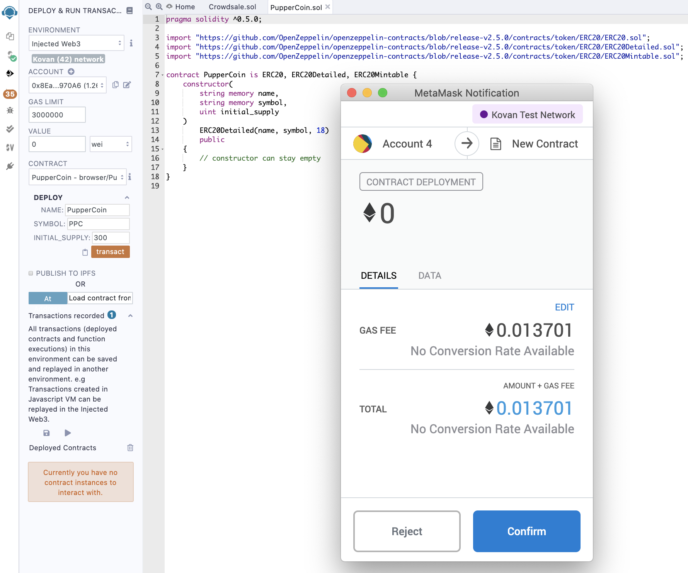
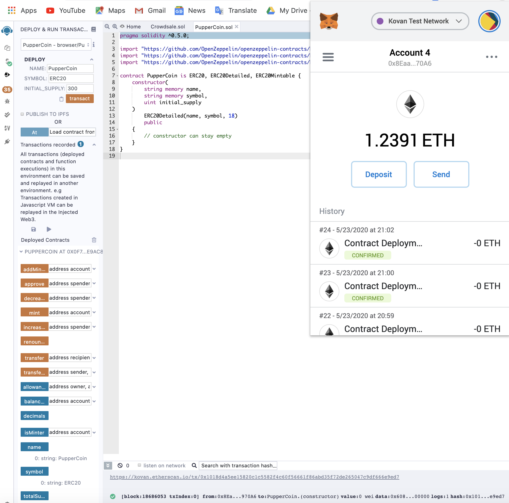
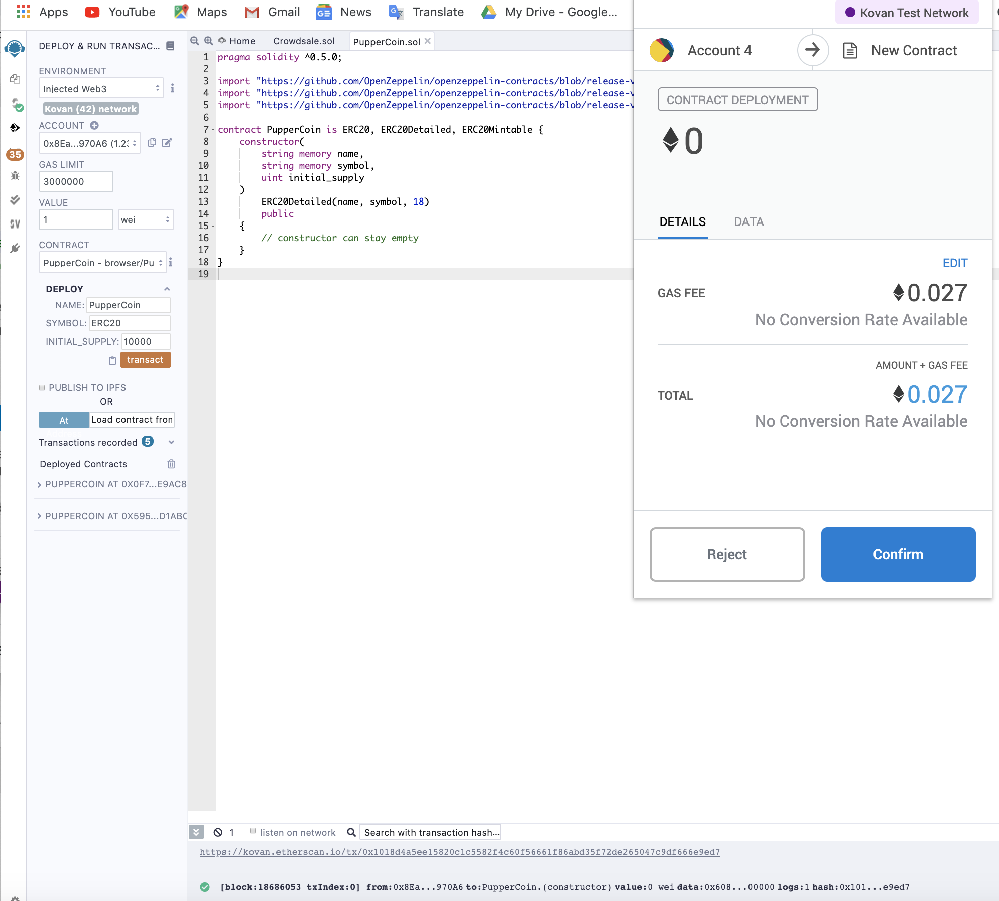
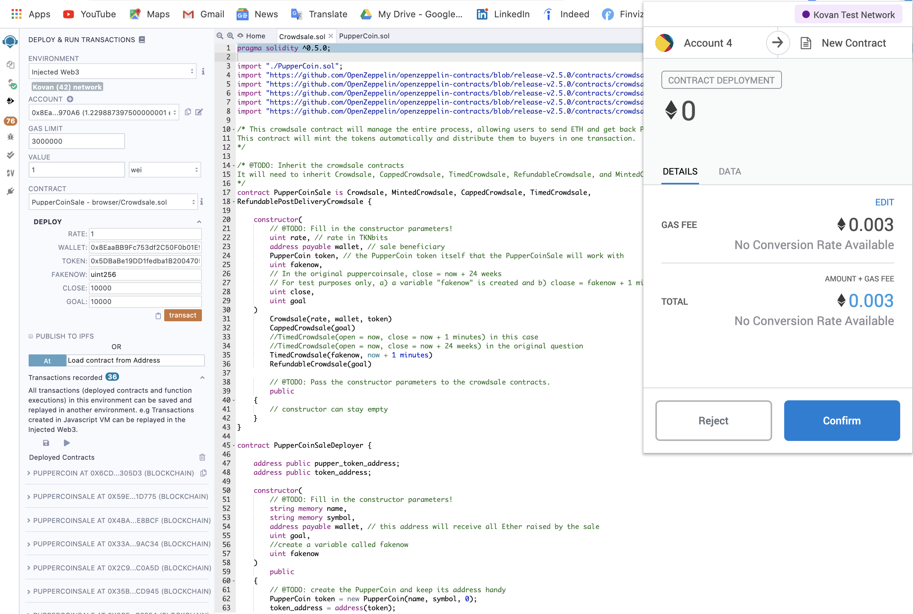
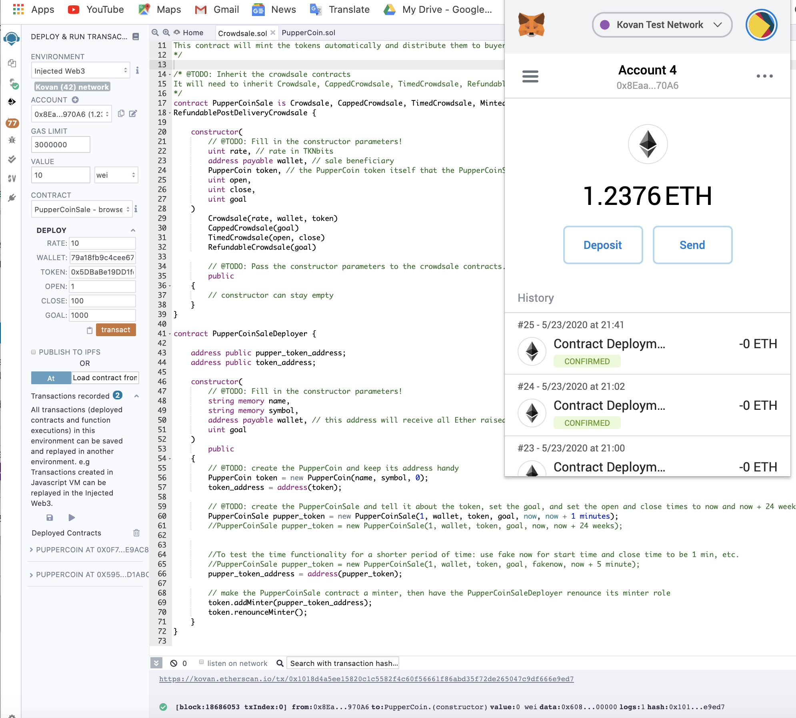
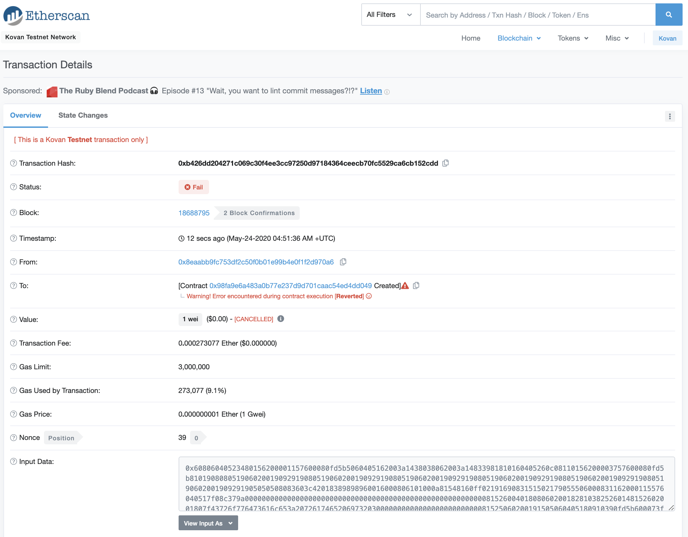

# Is_PupperCoin_Obiting
## _Crowd-selling PupperCoin to Discover Interesting Facts on our best friends_

## **Overview**
Crowd-selling PupperCoin coded on Solidity to fund generic trailing project on pups. Two contracts are written and deployed on Remix. 

* The _ENVIRONMENT_ on Remix is set to _**INJECTED WEB3**_ 

* MetaMask is tuned in _**KOVAN Test Network**_.

---

## _**[PupperCoin](Code/puppercoin.sol)**_

### **Transaction on EtherScan for Puppercoin Contract Deployment**

### **Puppercoin Contract Deployment on Remix**

PupperCoin Contract Deployment on Remix

_**Looks like it is a sucess!**_

Here is another setup for PupperCoin for Deployment:

---
## _**[CrowdSale](Code/crowdsale.sol)**_

### **Crowdsale Contract Deployment on Remix**

Another CrowdSale Contract Deployment Setup on Remix

However, the code is still in trouble-shooting stage. Updates coming up soon. 

Error Message on Etherscan

_**More Love for Pups**_

For getting testcoins, both Kovan and Ropsten faucets could do the job!

Kovan Testcoin

Ropsten Testcoin

# References
* http://remix.ethereum.org/
* https://faucet.ropsten.be/
* https://kovan.etherscan.io/
* https://solidity.readthedocs.io/
* https://medium.com/coinmonks/create-token-contract-and-time-limited-crowdsale-contract-with-whitelisting-in-solidity-1eb979d206f6
* https://ethereum.stackexchange.com/questions/51757/basic-crowdsale-contract
* https://ethereum.stackexchange.com/questions/51757/basic-crowdsale-contract