# Is_PupperCoin_Obiting
## _Crowd-selling PupperCoin to Discover Interesting Facts on our best friends_

## **Overview**
Crowd-selling PupperCoin coded on Solidity to fund generic trailing project on pups. Two contracts are written and deployed on Remix. 

* The _ENVIRONMENT_ on Remix is set to _**INJECTED WEB3**_ 

* MetaMask is tuned in _**KOVAN Test Network**_.


---

## _**[CrowdSale](Code/Crowdsale.sol)**_

### **Transaction on EtherScan for Puppercoin Contract Deployment**


### **Crowdsale Contract Deployment on Remix**

**Step 1. Deploy PupperCoinsSale Deployer Contract**

i) Enter the following information at **DEPLOY**:
```
NAME: PupperCoin
SYMBOL: PUP
WALLET: 0x5DBaBe19DD1fedba1B20047059DCd755D8221BF7
GOAL: 10000
```
ii) Click on **transact** button. 

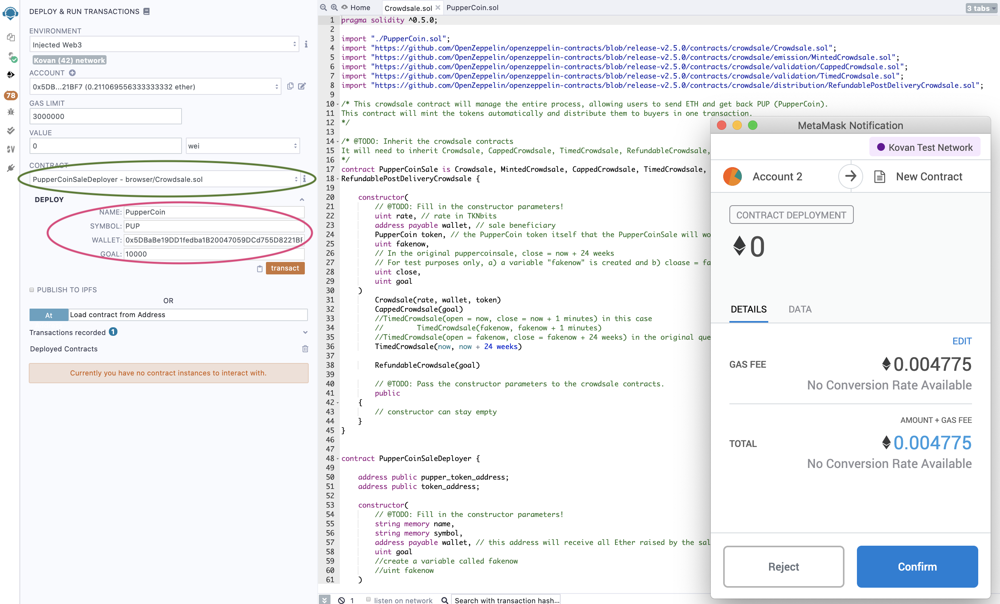

iii) Confirm on MetaMask pop-up window.

**Step 2. Deploy PupperCoinsSale Contract**

i) View addresses by clicking on blue buttons 
* pupper_token_address
* token_address

ii) Scroll CONTRACT to PupperCoinSale
<details><summary>
at pupper_token_address circled below:
</summary>

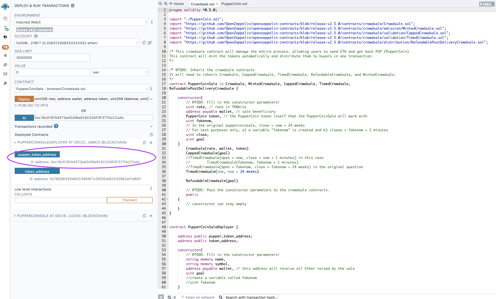

</details>

**Step 3. Deploy PupperCoins Contract**

---
## _**[PupperCoin](Code/PupperCoin.sol)**_

### **Transaction on EtherScan for Puppercoin buyTokens**
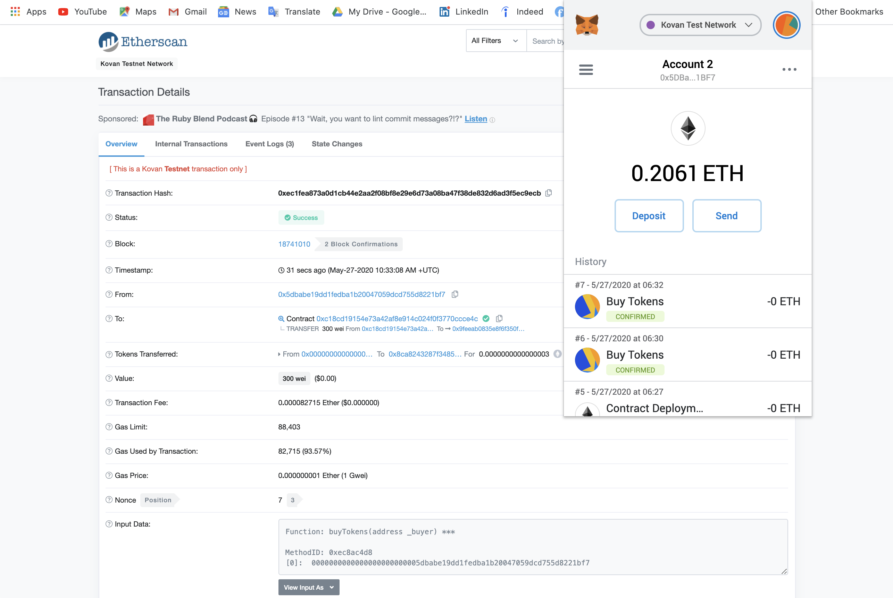

### **Puppercoin Contract Deployment on Remix**
<details><summary>
at token_address 
</summary>

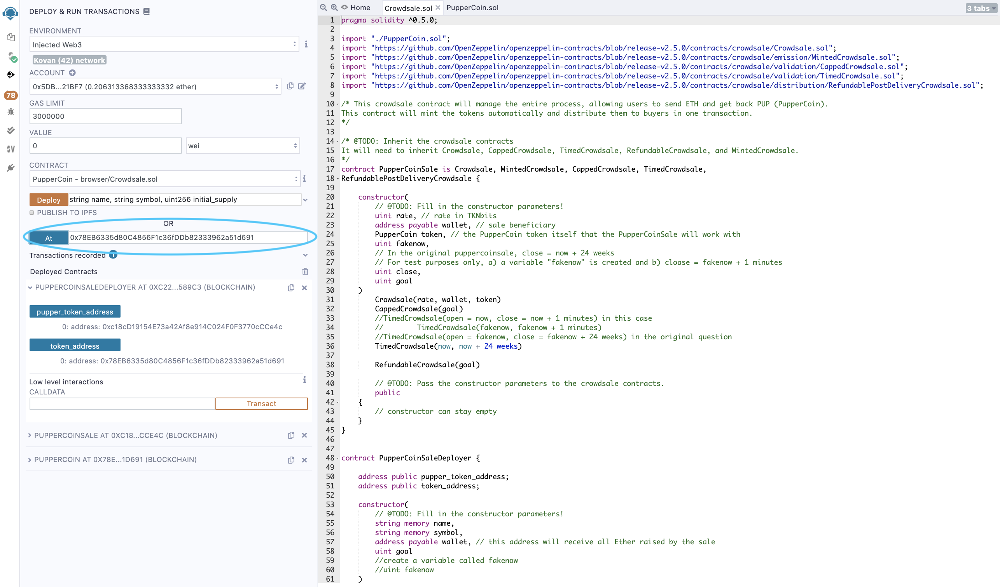

</details>

---

## _**Features**_


### **A. Buy Tokens under PupperCoinSale on Remix**

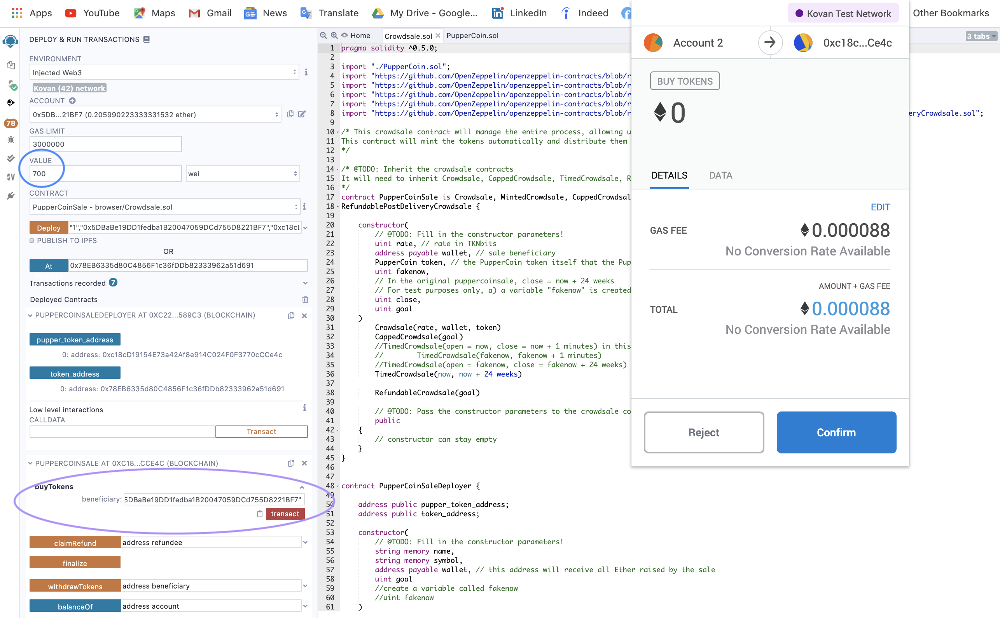

_**Looks like it is a sucess!**_

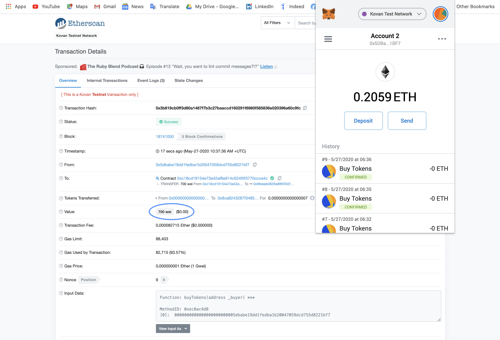


<details><summary>
Here is another buyTokens transaction for 3000 wei PupperCoin
</summary>

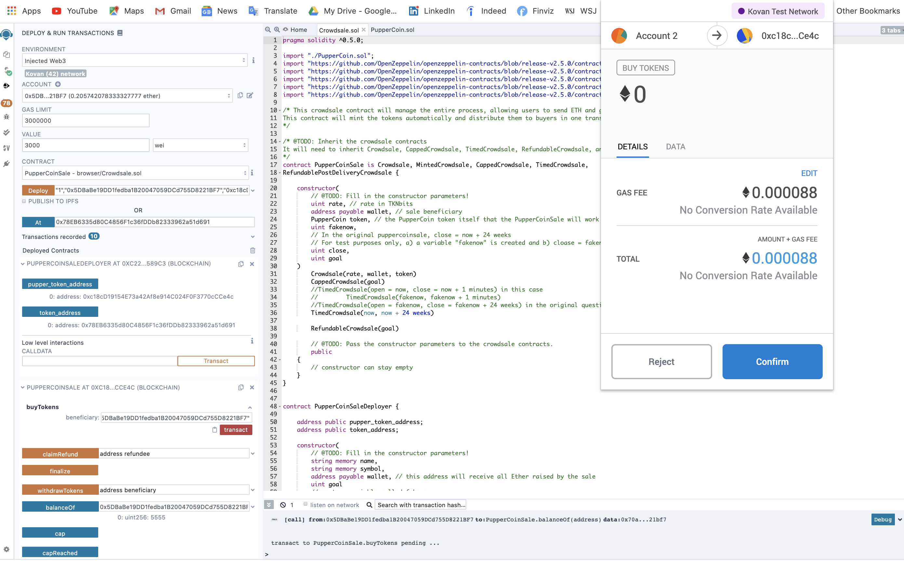

</details>

### **B. Approve Spending PUP**

<details><summary>
Click on `approve` under PUPPERCOIN contract
</summary>


</details>


### **C. Check Balance**

<details><summary>
Check balance by clicking on `balanceOf` under deployed `PupperCoinSale` Contract
</summary>

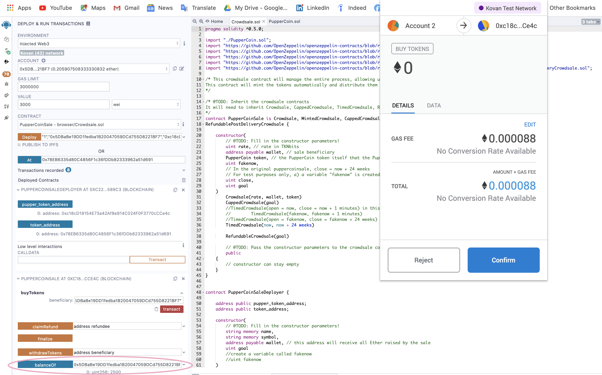

</details>

### **D. Add Tokens**

<details><summary>
Add Tokens by entering wallet Address, symbol `PUP` and 18 for decimals
</summary>

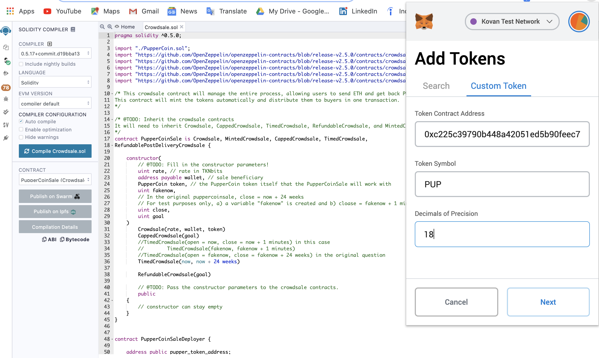

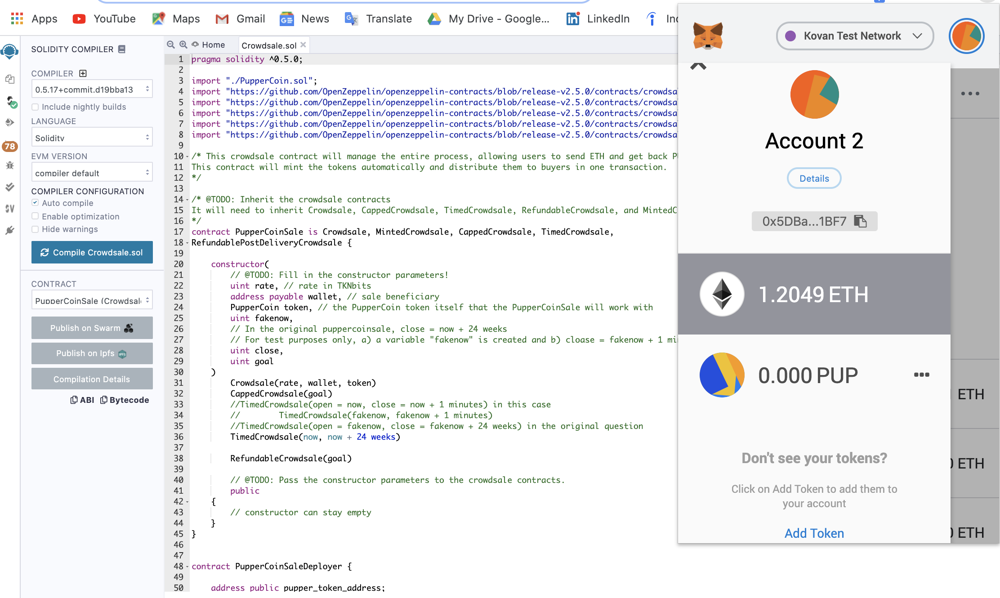


</details>

### **E. Transfer Tokens**

<details><summary>
Click on `transfer` under `PUPPERCOIN` function
</summary>


</details>

---

## **View Tokens on MyCrypto Wallet**

<details><summary>
Access wallet on MyCrypto via the PRIVATE KEY in Ganache.
</summary>

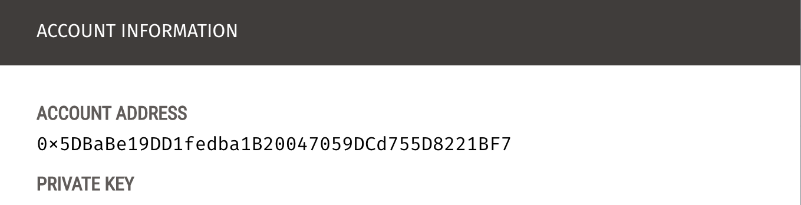

</details>

Press _**Scan for Tokens**_ button on the bottom right corner:


---
## The above processes can be done on Rinkeby and Ropsten Testnets by adjusting the network on MetaMask.

### _**On Rinkeby**_

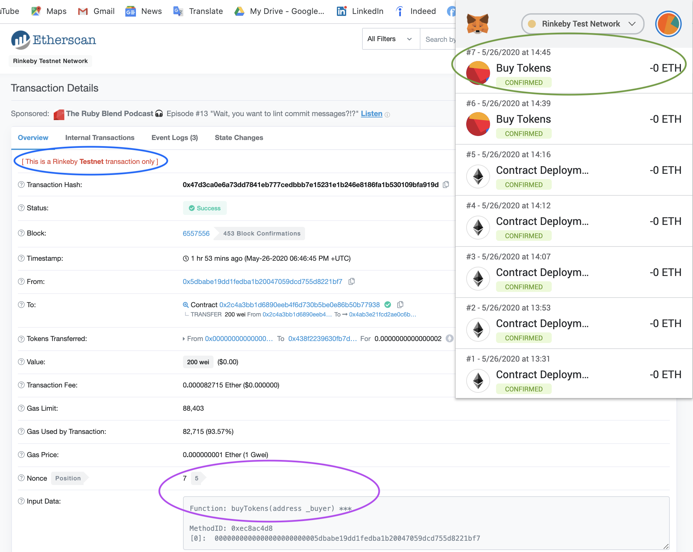


---
_**More Love for Pups**_

For getting testcoins, both Kovan and Ropsten faucets could do the job!

<details><summary>
Kovan Testcoins
</summary>

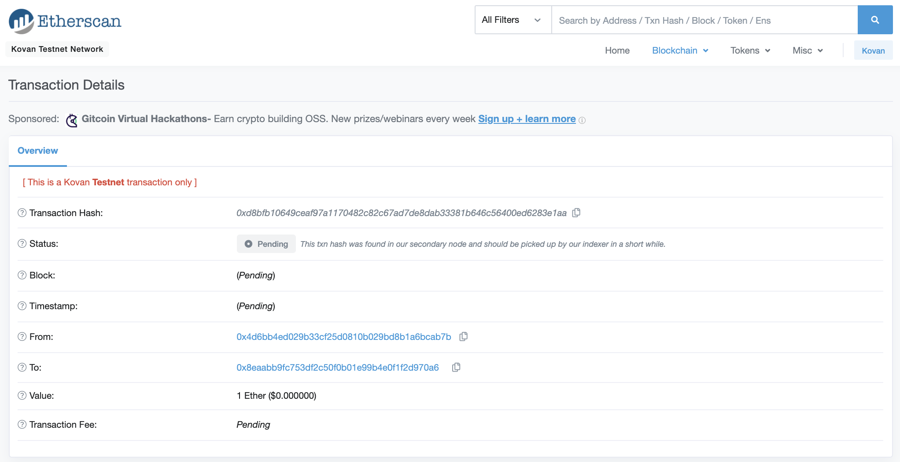

</details>

<details><summary>
Ropsten Testcoins
</summary>

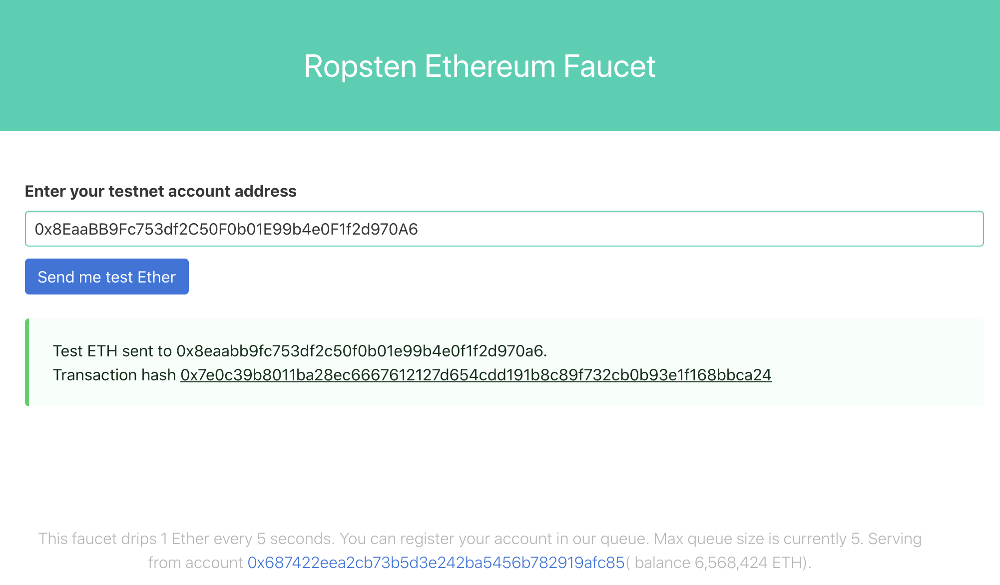

</details>

<details><summary>
Tweet for Rinkeby Testcoins
</summary>

_**Step 1: Go to [Rinkeby Faucet](https://faucet.rinkeby.io/)**_

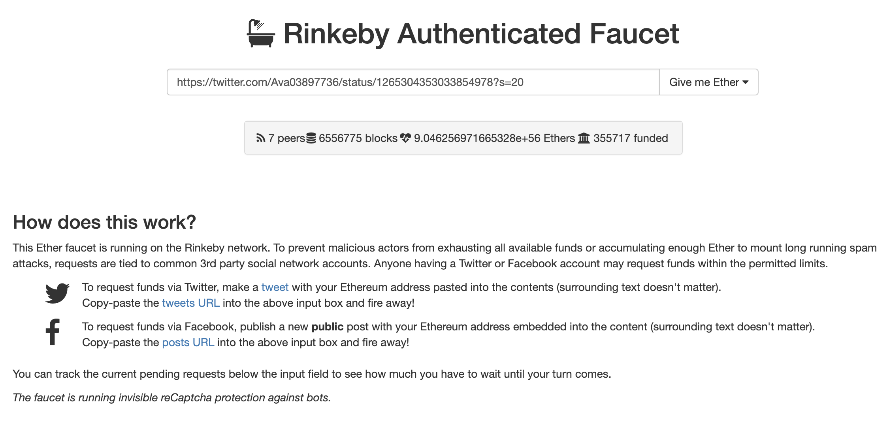

_**Step 2: Tweet the message with designated wallet address**_

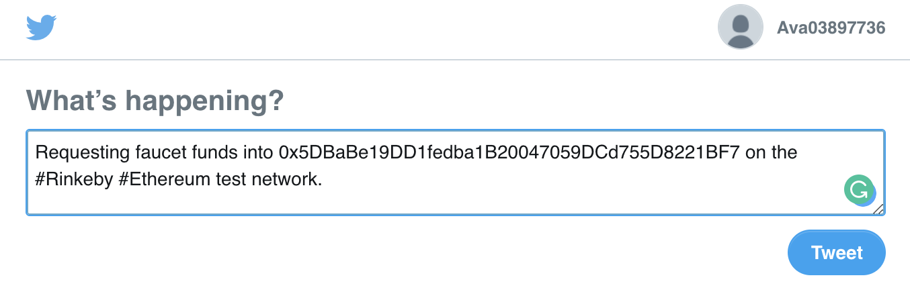

_**Step 3: Copy link on posted message on Twitter**_

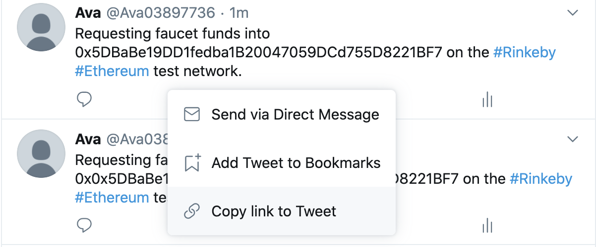

_**Step 4: Verify tweet**_


_**Step 5: Check balance on MetaMask**_


</details>

---
## Files

**[PupperCoin](Code/PupperCoin.sol)**

**[CrowdSale](Code/Crowdsale.sol)**

**[Kovan Transactions](Transactions/Kovan)**

**[Rinkeby Transactions](Transactions/Rinkeby)**

**[Images Folder](Images)**

---

# References
* Columbia University Fintech Bootcamp Repository
* http://remix.ethereum.org/
* https://faucet.ropsten.be/
* https://kovan.etherscan.io/
* https://solidity.readthedocs.io/
* https://medium.com/coinmonks/create-token-contract-and-time-limited-crowdsale-contract-with-whitelisting-in-solidity-1eb979d206f6
* https://ethereum.stackexchange.com/questions/51757/basic-crowdsale-contract
* https://ethereum.stackexchange.com/questions/51757/basic-crowdsale-contract
* https://github.com/raineorshine/solidity-by-example
* https://github.com/bkrem/awesome-solidity
* https://solidity.readthedocs.io/en/v0.5.3/solidity-by-example.html#simple-open-auction